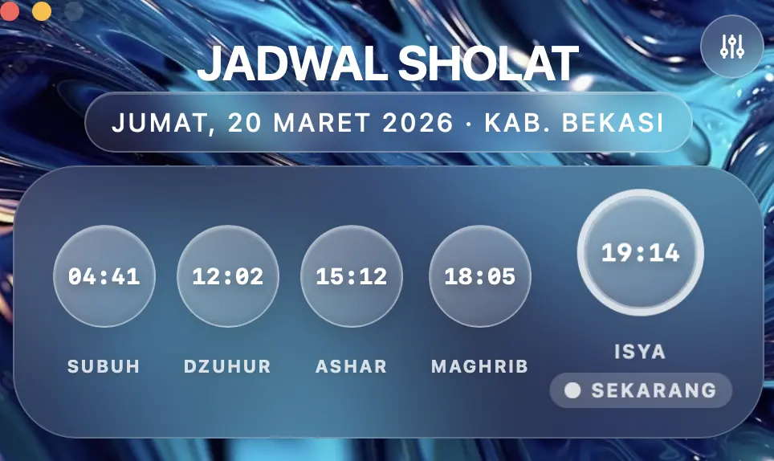
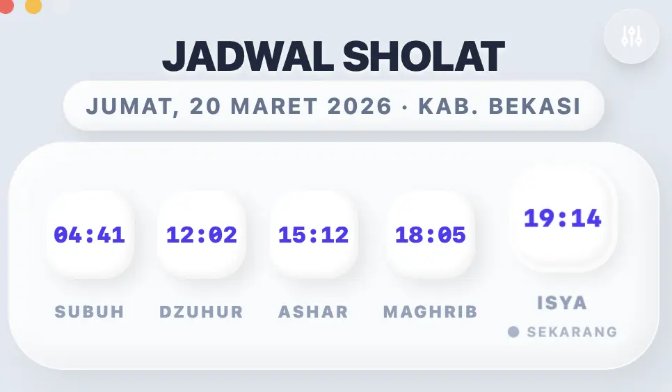
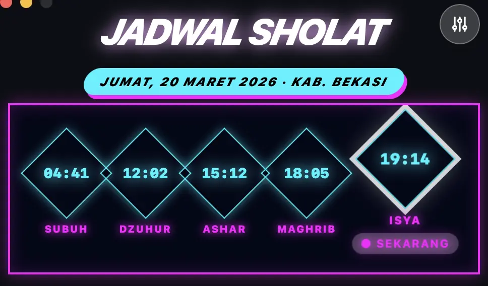
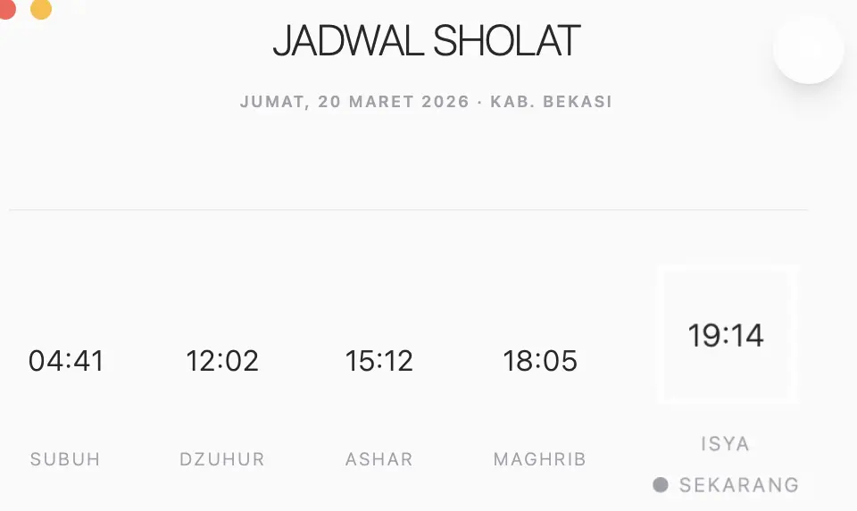
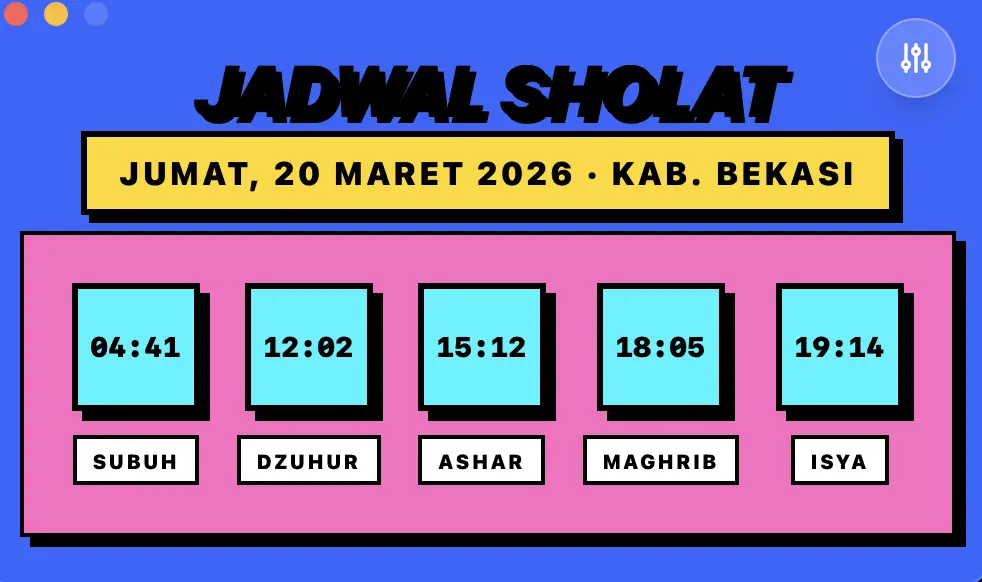
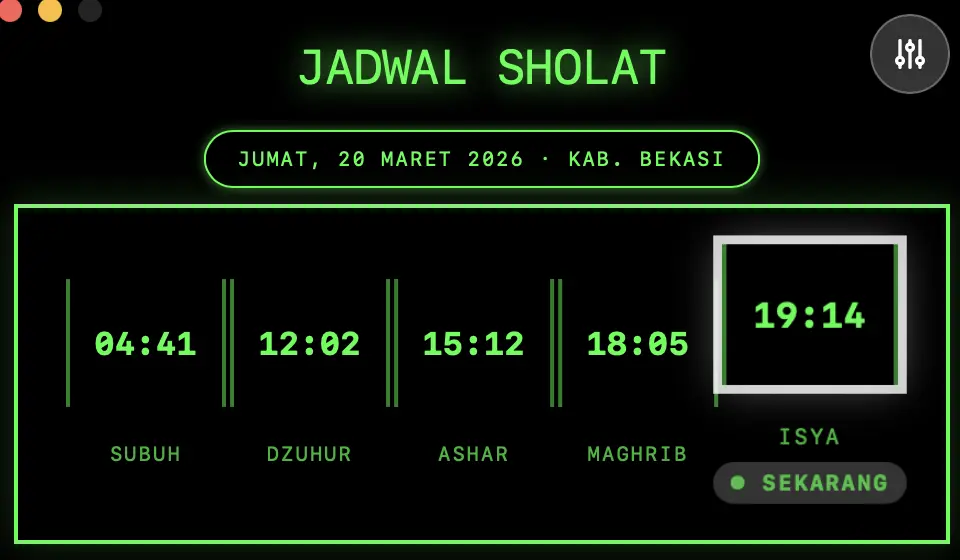
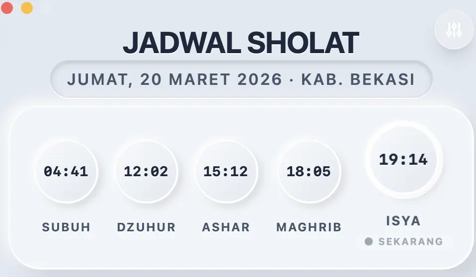

# 🕌 Jadwal Sholat App

> **Never miss a prayer — beautiful, free, and open source.**

A sleek desktop application that shows all 5 daily Muslim prayer times at a glance. Built with modern web technologies and packed with **7 stunning visual themes** to match your style and mood.

---

## ✨ Why You'll Love It

- 🕐 **Always Accurate** — Prayer times calculated precisely based on your location
- 🎨 **7 Beautiful Themes** — Switch styles with one click: Glassmorphism, Claymorphism, Cyberpunk, Minimalist, Neobrutal, Retro, Skeuomorphic
- ⚡ **Lightweight & Fast** — Opens instantly, stays out of your way
- 🖥️ **Cross-Platform** — Runs on macOS, Windows, and Linux
- 🆓 **100% Free & Open Source** — No subscriptions, no ads, no tracking

---

## 🎨 Themes Showcase

Choose a theme that feels like *you* — switch anytime from the settings button.

### 🌊 Glassmorphism
*Frosted glass panels floating over a fluid abstract background. Smooth, modern, and calming.*



---

### 🌸 Claymorphism
*Soft, puffy, inflated shapes with pastel colors. Clean, friendly, and satisfying.*



---

### ⚡ Cyberpunk
*Neon glows and dark backgrounds inspired by the future. Bold, electric, and dramatic.*



---

### 🤍 Minimalist
*Stripped back to the essentials. White space, clean typography, no distractions.*



---

### 🎨 Neobrutal
*Bold colors, thick borders, and flat shadows. Loud, fun, and unapologetically expressive.*



---

### 📺 Retro
*Pixel-perfect green-on-black terminal vibes. For those who miss the old days.*



---

### 🪘 Skeuomorphic
*Realistic textures and depth that feel tangible. Classic, tactile, familiar.*



---

## 📥 Download & Install

No coding knowledge needed. Just download and run.

| Platform | File Type |
|----------|-----------|
| 🍎 macOS    | `.dmg` or `.app` |
| 🪟 Windows  | `.exe` |
| 🐧 Linux    | `.AppImage` or `.deb` |

👉 **[Download the latest release →](../../releases)**

1. Click **Assets** under the latest release
2. Download the file for your operating system
3. Open it — that's it!

---

## 🛠️ For Developers

Want to contribute or run from source?

```bash
# Prerequisites: Bun (https://bun.sh)

git clone https://github.com/miref-fev/muslim-prayer-schedule.git
cd muslim-prayer-schedule
bun install
bun run dev:hmr
```

Build release binaries:
```bash
bun run build:canary
```

---

## 📜 License

Released under the [MIT License](LICENSE) — free to use, share, and modify.

---

<p align="center">
  Made with ❤️ for the Muslim community &nbsp;·&nbsp; <a href="../../releases">Download Now</a> &nbsp;·&nbsp; <a href="../../issues">Report a Bug</a>
</p>
